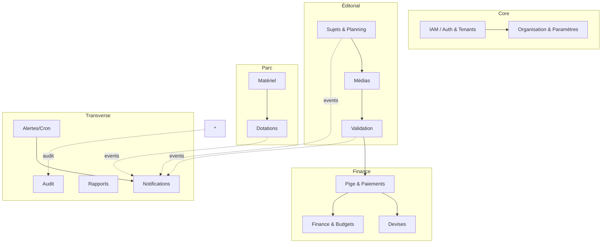

# Phase 4 — Architecture fonctionnelle (modules)

Découpage en **modules métier indépendants** (bounded contexts). Chaque module : rôle · responsabilités · dépendances · écrans · composants · données · événements · API · permissions · validations · erreurs · notifications.

Communication inter-modules : **appels de service typés** en interne (monolithe modulaire) + **événements de domaine** (bus in-process → queue) pour le découplage (notifications, audit, alertes).

---

## M1 — IAM (Auth & Tenants)
- **Rôle** : identité, sessions, rôles, cloisonnement tenant.
- **Responsabilités** : login/refresh/logout, 2FA, invitations, reset password, RLS context, RBAC.
- **Dépendances** : aucune (socle). **Écrans** : login, mot de passe oublié, 2FA, acceptation d'invitation.
- **Composants** : `AuthProvider`, intercepteur refresh, `RequireRole`.
- **Données** : User, RefreshToken, (Organisation), invitationToken.
- **Événements** : `user.invited`, `user.logged_in`, `user.locked`.
- **API** : `/auth/*`, `/invitations/*`. **Permissions** : public (login), authentifié (refresh/logout), ADMIN (inviter).
- **Validations** : email, force du mot de passe, expiration d'invitation.
- **Erreurs** : 401 (invalide), 423 (verrouillé), 410 (invitation expirée).
- **Notifications** : invitation, verrouillage, reset.

## M2 — Organisation & Paramètres
- **Rôle** : configuration par tenant.
- **Responsabilités** : devise pivot, taux, logo, seuils d'alertes, barème dégradation, modèles de documents, catégories.
- **Dépendances** : IAM. **Écrans** : paramètres org, devises, catégories matériel, barème.
- **Données** : Organisation, Currency, CategorieMateriel, BaremeDegradation, DocumentTemplate.
- **Événements** : `org.settings_changed`, `currency.rate_updated`.
- **API** : `/org`, `/currencies`, `/categories`, `/bareme`. **Permissions** : ADMIN.
- **Erreurs** : 409 (devise pivot verrouillée si documents émis).

## M3 — Sujets & Planning
- **Rôle** : cycle de vie éditorial. **Responsabilités** : CRUD sujet, assignation, machine à états, planning kanban/calendrier.
- **Dépendances** : IAM, Org. **Écrans** : liste sujets, détail, kanban, calendrier, formulaire.
- **Composants** : `SujetCard`, `KanbanBoard`, `CalendarView`, `StatutBadge`, `PrioriteDot`.
- **Données** : Sujet, (rubrique). **Événements** : `sujet.assigned`, `sujet.status_changed`, `sujet.delivered`.
- **API** : `/sujets`, `/sujets/:id`, `/sujets/:id/statut`. **Permissions** : REDACTEUR/ADMIN (CRUD), JRI (lecture + statut de ses sujets).
- **Validations** : transitions autorisées, échéance ≥ aujourd'hui à la création.
- **Erreurs** : 409 (transition invalide), 403 (JRI sur sujet d'autrui).
- **Notifications** : assignation, échéance J-2, retard.

## M4 — Médias
- **Rôle** : dépôt/versionnement des éléments livrés. **Responsabilités** : upload résumable, versioning, vignettes, preview.
- **Dépendances** : Sujets, Stockage(S3). **Écrans** : médiathèque, uploader, viewer.
- **Composants** : `ResumableUploader`, `MediaGrid`, `MediaPreview`.
- **Données** : SujetElement. **Événements** : `media.uploaded`, `media.version_added`.
- **API** : `/sujets/:id/medias`, `/medias`, présignation multipart. **Permissions** : JRI (dépôt sur ses sujets), REDACTEUR (revue).
- **Validations** : type MIME, taille/quota tenant, scan antivirus.
- **Erreurs** : 413 (quota), 415 (type), 422 (upload incomplet).

## M5 — Validation
- **Rôle** : contrôle éditorial. **Responsabilités** : valider/rejeter, commentaires horodatés, lien version.
- **Dépendances** : Sujets, Médias. **Écrans** : panneau de validation (détail sujet).
- **Données** : Validation. **Événements** : `sujet.validated`, `sujet.rejected`.
- **API** : `/sujets/:id/validation`. **Permissions** : REDACTEUR/ADMIN.
- **Notifications** : au JRI (validé/rejeté), escalade si en attente > seuil.

## M6 — Pige & Paiements
- **Rôle** : rémunération. **Responsabilités** : calcul (snapshot tarifs), fiches, documents (bordereau/fiche/reçu), validation de paiement, relances.
- **Dépendances** : Validation (sujets validés), JriProfile, Devises. **Écrans** : liste fiches, calcul, validation paiement, exports.
- **Composants** : `FicheTable`, `CalculPigeModal`, `PayerModal`.
- **Données** : FichePaiement, PaiementLigne. **Événements** : `fiche.generated`, `fiche.paid`.
- **API** : `/paiements`, `/paiements/calculer`, `/paiements/:id/pdf`, `/paiements/:id/payer`, exports. **Permissions** : COMPTABLE/ADMIN ; JRI (lecture de ses fiches).
- **Validations** : période non verrouillée pour recalcul ; fiche PAYEE immuable (RG-02).
- **Erreurs** : 409 (période verrouillée / fiche payée), 404.
- **Notifications** : payé (JRI), impayé gradué (compta).

## M7 — Devises
- **Rôle** : multi-devise. **Responsabilités** : devise pivot/org, taux historisés, conversion, gel sur documents.
- **Dépendances** : Org. **Données** : Currency, TauxHistorique. **API** : `/currencies`. **Permissions** : ADMIN (édition), tous (lecture/affichage).

## M8 — Finance & Budgets
- **Rôle** : pilotage financier. **Responsabilités** : budget rubrique/mois, réalisé, consolidation, alertes dépassement.
- **Dépendances** : Paiements, Org. **Écrans** : finance consolidée, budgets.
- **Données** : Budget. **Événements** : `budget.exceeded`. **API** : `/budgets`, `/finance`. **Permissions** : ADMIN/COMPTABLE (+REDACTEUR lecture budget).

## M9 — Matériel
- **Rôle** : parc. **Responsabilités** : catalogue, états, garanties, QR, maintenance, incidents.
- **Dépendances** : Org (catégories). **Écrans** : liste, détail, maintenance, incidents.
- **Composants** : `MaterielTable`, `QRBadge`, `MaintenanceForm`.
- **Données** : Materiel, Maintenance, IncidentMateriel. **Événements** : `materiel.warranty_expiring`, `maintenance.opened`.
- **API** : `/materiel/*`. **Permissions** : REDACTEUR/logistique/ADMIN ; COMPTABLE (lecture coûts).

## M10 — Dotations
- **Rôle** : remises/retours. **Responsabilités** : remise signée+photos, retour+contrôle, dégradation, fiche responsabilité.
- **Dépendances** : Matériel, IAM(JRI), Stockage. **Écrans** : liste dotations, remise, retour, signature.
- **Composants** : `SignaturePad`, `PhotoUploader`, `EtatSelector`.
- **Données** : Dotation. **Événements** : `dotation.created`, `dotation.returned`, `dotation.degraded`.
- **API** : `/dotations/*`. **Permissions** : REDACTEUR/ADMIN (gérer), JRI (voir + signer les siennes).
- **Notifications** : dotation non signée, non-restituée.

## M11 — Notifications
- **Rôle** : diffusion multi-canal asynchrone. **Responsabilités** : file, rendu, préférences, dedup, digest.
- **Dépendances** : tous (consommateur d'événements). **Écrans** : cloche, préférences.
- **Données** : Notification, NotificationPreference. **API** : `/notifications`. **Permissions** : propriétaire.

## M12 — Alertes (Cron)
- **Rôle** : détections planifiées. **Responsabilités** : scans quotidiens (garantie, non-restitué, entretien, retard, échéance J-2, escalade validation, impayés), lock distribué.
- **Dépendances** : Matériel, Dotations, Sujets, Paiements, Notifications. **API** : `/alertes/run` (admin/rédac). 

## M13 — Rapports
- **Rôle** : analytics. **Responsabilités** : rapports périodiques, classements, exports, programmation.
- **Dépendances** : Sujets, Paiements, Finance, Parc. **Écrans** : rapports. **Permissions** : ADMIN/REDACTEUR/COMPTABLE.

## M14 — Audit
- **Rôle** : traçabilité. **Responsabilités** : capter les mutations sensibles (append-only), recherche.
- **Dépendances** : tous (via middleware/événements). **Écrans** : journal d'audit. **Données** : AuditLog. **Permissions** : ADMIN.

## M15 — Dashboard
- **Rôle** : synthèse par rôle. **Responsabilités** : agrégats/KPI, widgets. **Dépendances** : lecture transverse. **Permissions** : tous (vue selon rôle).
