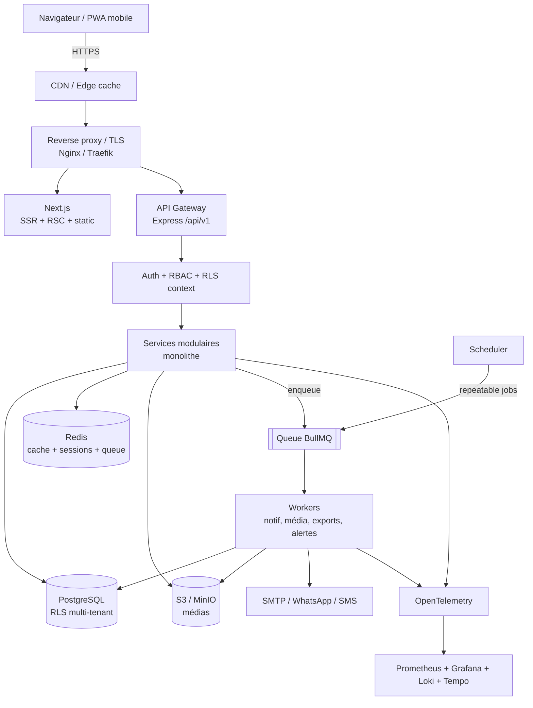

# Phase 5 — Architecture technique

## 5.1 Principe directeur

**Monolithe modulaire** (pas de microservices). Justification : équipe petite, volume cible modéré (D7), domaines fortement couplés (pige dépend de validation qui dépend des médias). Les microservices ajouteraient latence réseau, complexité opérationnelle et coûts sans bénéfice au stade actuel. On conserve des **frontières de modules nettes** (Phase 4) pour extraire un service plus tard si un besoin de scale isolé apparaît (ex. pipeline média).

Stateless partout où possible → **scalabilité horizontale** du backend et des workers. État dans Postgres + Redis + S3.

## 5.2 Vue d'ensemble

## 5.3 Composants

### Frontend
- **Next.js 14 App Router**, mais **corriger la dette** : pages `'use client'` uniquement là où l'interactivité l'exige ; le reste en **Server Components** (fetch serveur, moins de JS, meilleur TTI/SEO).
- **PWA** : service worker, offline partiel (consultation + file d'attente d'uploads), installable mobile.
- État serveur via **TanStack Query** (cache, retry, refetch), formulaires **react-hook-form + Zod**.
- i18n FR/EN (déjà `lib/i18n`), à compléter.

### Backend / API Gateway
- **Express** `/api/v1`, un seul déploiement. Middlewares : helmet/CSP, CORS strict, morgan→JSON, rate-limit, auth, **contexte tenant (RLS)**, validation Zod, gestion d'erreurs centralisée.
- Couches : `routes` → `controllers` → `services` (métier) → `repositories` (Prisma). Services émettent des **événements de domaine**.

### Workers & Queues
- **BullMQ (Redis)**. Files : `notifications`, `media` (vignettes/transcodage/AV), `exports` (PDF/Excel gros volumes), `alertes` (repeatable), `webhooks`.
- Idempotence par clé de job ; retries + backoff ; DLQ.
- **Cron** = jobs BullMQ *repeatable* (remplace `node-cron` mono-instance → évite double exécution en scale horizontal ; lock natif).

### Cache / Redis
- Sessions/refresh denylist, cache de listes et d'agrégats dashboard, taux de change, rate-limit counters, verrous distribués.

### Base SQL
- **PostgreSQL** unique, multi-tenant par **Row-Level Security** (`organisation_id` + policies). Migrations **Prisma Migrate** versionnées (D2). Read-replica ajoutée si lecture lourde (rapports).

### Recherche (D6)
- **Postgres full-text** (`tsvector` + index GIN) sur sujets/JRI/matériel. Externaliser (Meilisearch) seulement si volume/pertinence l'exige — repoussé.

### Stockage fichiers & CDN
- **S3/MinIO**, upload **multipart présigné** (résumable), buckets par tenant ou préfixe `org/<id>/`. **CDN** devant les médias publics (vignettes/preview) ; originaux privés via URL présignée courte. Politique de **tiering/rétention** (vidéos lourdes).

### Auth & RBAC
- JWT access court + refresh révocable (denylist Redis), 2FA TOTP, invitations. RBAC 4 rôles + permissions fines ; RLS pour l'isolation dure des données.

### Observabilité
- **OpenTelemetry** (traces) → Tempo ; **métriques** Prometheus (RED/USE) → Grafana ; **logs** structurés → Loki. Corrélation par `requestId`/`traceId`/`tenantId`. Alerting Grafana/Alertmanager (voir §16 monitoring).

### CI/CD & Tests
- **GitHub Actions** : lint → typecheck → tests unitaires (Vitest) → tests API (supertest) → build images → scan (Trivy) → push registry → déploiement.
- Environnements : `preview` (PR), `staging`, `production`. Migrations jouées en étape dédiée avant bascule.
- Tests : unitaires (calc), **API (supertest)**, **E2E (Playwright)** sur parcours critiques, tests de charge (k6) sur endpoints chauds.

### Conteneurisation / Orchestration
- **Docker** (déjà). **V2** : Docker Compose sur VPS suffit (mono-nœud + backups externalisés). **Kubernetes** seulement au palier Enterprise/HA (multi-nœuds, autoscaling) — pas avant besoin réel (évite la sur-ingénierie).

### Scalabilité / Tolérance aux pannes / HA
- Backend & workers **stateless** → réplicas horizontaux derrière le reverse proxy.
- Postgres : vertical + read-replica + **PITR** (WAL archivé) → RPO ≤ 1 h.
- MinIO : mode distribué (érasure coding) au palier HA ; sinon single + backup + réplication bucket.
- Health checks + restart policies + circuit breakers sur services externes (mail/WhatsApp).

### Secrets & Configuration
- Secrets hors dépôt : **coffre** (Docker secrets / SOPS / Vault selon palier). `.env` jamais committé (déjà gitignore). Config par environnement, 12-factor.

## 5.4 Décisions d'architecture (ADR condensés)

| ADR | Décision | Raison |
|-----|----------|--------|
| ADR-1 | Monolithe modulaire | Équipe/volume ; couplage métier fort |
| ADR-2 | Multi-tenant RLS mutualisé (D1) | Standard SaaS B2B ; coût/isolation équilibrés |
| ADR-3 | BullMQ pour async + cron | Découplage, retries, lock distribué |
| ADR-4 | Prisma Migrate (D2) | Sécurité des données, rollback |
| ADR-5 | Postgres FTS avant moteur externe (D6) | YAGNI ; suffisant au volume |
| ADR-6 | Next.js RSC/SSR (réduire `use client`) | Perf, SEO, moins de JS |
| ADR-7 | K8s différé | Éviter sur-ingénierie ; Compose + backups suffisent en V2 |
