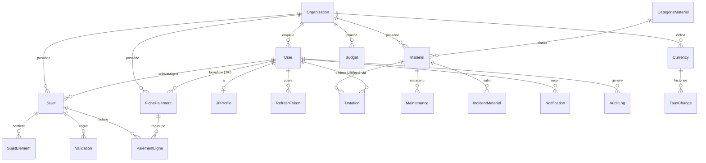

# Phase 6 — Modèle de données

## 6.1 Choix de modélisation

- **Multi-tenant (D1=B)** : ajout d'`Organisation` + colonne `organisationId` sur **toutes** les tables métier, avec **Row-Level Security** Postgres (policy `organisation_id = current_setting('app.org_id')`). Le backend positionne `app.org_id` par requête après auth.
- **Montants** : `Decimal(12,2)` (18,6 pour les taux) — jamais de float. Stockés dans la **devise pivot de l'organisation**.
- **Snapshots de tarif** : les lignes de pige (`PaiementLigne`) portent `tarif`/`montant` figés (RG-03) — indépendants des évolutions de `JriProfile`.
- **Soft delete** : `deletedAt` sur les entités métier (RG-07) ; hard delete réservé RGPD.
- **Historisation des taux** : nouvelle table `TauxChange` (RG-08) ; les documents émis référencent le taux gelé.
- **Références lisibles** : `SUJ-AAAA-NNNN`, `PIGE-AAAA-MM-NNNN` — séquence par organisation.
- **Audit append-only** : `AuditLog` sans update/delete (contrainte + révocation de droits).

## 6.2 ERD (cible V2)

## 6.3 Tables (nouvelles/modifiées V2)

### Organisation (NOUVELLE)
| Colonne | Type | Contraintes |
|---------|------|-------------|
| id | cuid | PK |
| nom | text | not null |
| slug | text | unique |
| devisePivot | text (FK Currency.code) | not null, défaut 'GNF' |
| logoUrl | text | null |
| pays | text | null |
| plan | enum(STARTER,PRO,ENTERPRISE) | défaut STARTER |
| parametres | jsonb | seuils alertes, modèles doc |
| createdAt/updatedAt | timestamptz | |
- **Règle** : `devisePivot` non modifiable si des documents (`FichePaiement`) émis existent (D3).

### User (MODIFIÉE)
Ajouts : `organisationId` (FK, not null, index), `twoFactorSecret` (text null, **chiffré**), `twoFactorEnabled` (bool), `lastLoginAt`, `failedLoginCount`, `lockedUntil`, `deletedAt`.
Index : `(organisationId, role)`, `(organisationId, email)` unique. **RLS** activée.

### JriProfile (MODIFIÉE)
`iban`/`banque` → **chiffrés au repos** (pgcrypto ou chiffrement applicatif). Ajout `deviseTarif` (FK Currency, défaut = pivot org). Colonnes existantes conservées : `tarifParSujet`, `tarifParMinute`, `tarifPersonnalise (jsonb)`, `pays`, `modePaiementPrefere`, `specialite`, `bio`.

### Sujet (MODIFIÉE)
Ajouts : `organisationId` (FK, index), `deletedAt`. Conserve `reference` (unique **par org**), `titre`, `description`, `rubrique`, `jriId`, `createdById`, `dateLimite`, `priorite`, `statut`, `dureeMinutes`, `livreLe`, `valideLe`.
Index : `(organisationId, statut)`, `(organisationId, jriId)`, `(organisationId, dateLimite)`. **FTS** : colonne `searchVector tsvector` + index GIN.
- **Règle** : machine à états (RG-04) — transitions valides uniquement.

### SujetElement (MODIFIÉE)
Ajouts : `organisationId`, `thumbnailKey` (vignette), `status` (enum UPLOADING/READY/FAILED pour multipart), `checksum`. Conserve `type`, `nomFichier`, `storageKey`, `url`, `mime`, `tailleOctets (bigint)`, `version`, `uploadedById`.

### Validation (INCHANGÉE + org)
`+organisationId`, `+versionRef` (lien vers `SujetElement.version` évaluée). Conserve `action` (VALIDE/REJETE/CORRECTION_DEMANDEE), `commentaire`, `validateurId`.

### Currency (MODIFIÉE)
Devient **par organisation** : PK composite `(organisationId, code)`. Conserve `nom`, `symbole`, `tauxGnf`→`tauxPivot` (1 unité = tauxPivot devise pivot), `actif`, `parDefaut`.

### TauxChange (NOUVELLE — historisation D3/RG-08)
| id | organisationId | code | tauxPivot Decimal(18,6) | effectiveFrom timestamptz | source |
Index `(organisationId, code, effectiveFrom)`.

### FichePaiement (MODIFIÉE)
Ajouts : `organisationId`, `deviseCode` (devise d'émission), `tauxGele Decimal(18,6)`, `verrouille bool` (période), `pdfKey`. Conserve `reference` (unique/org), `jriId`, `annee`, `mois`, `nbSujets`, `totalMinutes`, `montantBase`, `bonus`, `penalites`, `montantTotal`, `statut` (BROUILLON/GENEREE/PAYEE), `payeeLe`, `modePaiement`, `referencePaiement`. Unicité `(organisationId, jriId, annee, mois)`.
- **Règle** : `PAYEE` ⇒ lignes immuables (RG-02).

### PaiementLigne (INCHANGÉE + org)
`+organisationId`. Conserve `ficheId`, `sujetId?`, `libelle`, `quantite`, `tarif` (**figé**), `montant`.

### Budget (MODIFIÉE)
`+organisationId`. Unicité `(organisationId, rubrique, annee, mois)`. Conserve `montantPrevu`.

### Materiel / CategorieMateriel / Maintenance / IncidentMateriel (MODIFIÉES + org)
`+organisationId` partout ; `reference`/`numInventaire` uniques **par org**. Materiel conserve `marque`, `modele`, `numSerie`, `dateAchat`, `fournisseur`, `coutAcquisition`, `garantieFin`, `etat`, `statut`, `qrCodeData`, `qrCodeUrl`. Index `(organisationId, statut)`.

### Dotation (MODIFIÉE + org)
`+organisationId`, `+signatureHash` (intégrité), `+signedAt`, `+ficheResponsabiliteKey` (PDF). Conserve `materielId`, `jriId`, `responsableId`, `dateRemise`, `etatRemise`, `photosRemise[]`, `signatureUrl`, `observations`, `statut` (EN_COURS/RESTITUE), `dateRetour`, `etatRetour`, `photosRetour[]`, `validateurId`, `montantDegradation`, `observationsRetour`.

### BaremeDegradation (NOUVELLE — extériorise `BAREME_DEGRADATION`)
| id | organisationId | etatDepart | etatRetour | tauxPct Decimal(5,2) |
Rend le barème configurable par organisation (aujourd'hui en dur dans `calc.ts`).

### Notification (MODIFIÉE + org)
`+organisationId`, `+type` (clé d'événement pour dedup/préférences). Conserve `canal`, `titre`, `message`, `lien`, `lu`.

### NotificationPreference (NOUVELLE)
| userId | type | canaux[] | actif | — préférences par utilisateur/événement.

### RefreshToken (INCHANGÉE)
Conserve `token` (unique), `userId`, `expiresAt`, `revoked`. + index cleanup.

### AuditLog (MODIFIÉE + org)
`+organisationId`. Append-only (pas d'update/delete). Conserve `userId?`, `action`, `entite`, `entiteId?`, `details (jsonb)`, `ip`, `createdAt`. Index `(organisationId, entite, entiteId)`, `(organisationId, createdAt)`.

### Webhook / WebhookDelivery (NOUVELLES — Enterprise)
Endpoints sortants par organisation + journal de livraison (retries).

## 6.4 Enums

`Role`(ADMIN,REDACTEUR,JRI,COMPTABLE), `Priorite`(BASSE,NORMALE,HAUTE,URGENTE), `StatutSujet`(ASSIGNE,EN_COURS,LIVRE,VALIDE,REJETE), `TypeElement`(VIDEO,AUDIO,PHOTO,DOCUMENT), `ActionValidation`(VALIDE,REJETE,CORRECTION_DEMANDEE), `StatutFiche`(BROUILLON,GENEREE,PAYEE), `EtatMateriel`(NEUF,BON_ETAT,A_REPARER,HORS_SERVICE,PERDU,VOLE), `StatutMateriel`(DISPONIBLE,AFFECTE,MAINTENANCE,PERDU,VOLE), `StatutDotation`(EN_COURS,RESTITUE), `TypeIncident`(PANNE,PERTE,VOL,DEGRADATION), `CanalNotif`(INTERNE,EMAIL,WHATSAPP,SMS,PUSH), `PlanOrg`(STARTER,PRO,ENTERPRISE).

## 6.5 Stratégie d'indexation

- Toujours préfixer par `organisationId` (co-locate + RLS efficace).
- Index couvrants pour listes paginées triées (`createdAt desc`).
- GIN sur `searchVector` (FTS) et sur colonnes `jsonb` interrogées.
- Index partiels pour statuts chauds (ex. `WHERE statut='EN_COURS'`).

## 6.6 Migration V1→V2 (voir DT-01)

1. Passer `db push` → **Prisma Migrate** (baseline sur le schéma actuel).
2. Créer `Organisation` par défaut, backfill `organisationId` sur toutes les lignes.
3. Rendre `organisationId` NOT NULL, activer RLS + policies.
4. Chiffrer les colonnes PII existantes (IBAN/banque).
5. Extraire le barème en table ; historiser les taux courants.
