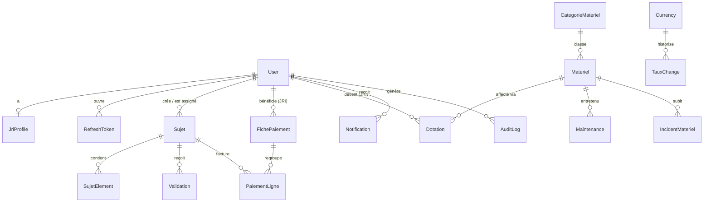

# Phase 6 — Modèle de données

> **D1=A (outil interne mono-org)** : pas de table `Organisation`, pas d'`organisationId`, pas de Row-Level Security. Une seule organisation implicite. Le schéma V1 est conservé et **enrichi** (pas refondu).

## 6.1 Choix de modélisation

- **Montants** : `Decimal(12,2)` (18,6 pour les taux) — jamais de float. Stockés en **GNF** (devise de base globale, D3=A), conversion à l'affichage.
- **Snapshots de tarif** : les lignes de pige (`PaiementLigne`) portent `tarif`/`montant` **figés** (RG-03) — indépendants des évolutions ultérieures de `JriProfile`.
- **Soft delete** : `deletedAt` sur les entités métier (RG-07) ; hard delete réservé aux demandes RGPD.
- **Historisation des taux** : nouvelle table `TauxChange` (RG-08) ; les documents émis référencent le taux gelé au moment de l'émission.
- **Références lisibles** : `SUJ-AAAA-NNNN`, `PIGE-AAAA-MM-NNNN` — séquence globale.
- **Audit append-only** : `AuditLog` sans update/delete (droits révoqués + convention).
- **PII sensible** : `iban`/`banque` chiffrés au repos.

## 6.2 ERD

## 6.3 Tables (évolutions V2 sur le schéma existant)

> Seules les **évolutions** sont listées. Les tables non citées restent conformes à `schema.prisma` V1.

### User (MODIFIÉE — sécurité)
Ajouts : `twoFactorSecret` (text null, **chiffré**), `twoFactorEnabled` (bool), `lastLoginAt` (timestamptz), `failedLoginCount` (int, défaut 0), `lockedUntil` (timestamptz null), `deletedAt` (timestamptz null).
Conserve : `email` (unique), `passwordHash`, `nom`, `prenom`, `telephone`, `role`, `actif`, `invitationToken`/`invitationExpiry`. Index `role` conservé.

### JriProfile (MODIFIÉE — PII)
`iban` et `banque` → **chiffrés au repos** (chiffrement applicatif ; UI masque l'IBAN). Colonnes conservées : `tarifParSujet`, `tarifParMinute`, `tarifPersonnalise (jsonb)`, `pays`, `modePaiementPrefere`, `specialite`, `bio`.

### Sujet (MODIFIÉE)
Ajouts : `deletedAt`, colonne `searchVector tsvector` (**FTS**) + index GIN. Conserve `reference` (unique global), `titre`, `description`, `rubrique`, `jriId`, `createdById`, `dateLimite`, `priorite`, `statut`, `dureeMinutes`, `livreLe`, `valideLe`. Index conservés (`statut`, `jriId`, `dateLimite`).
- **Règle** : machine à états serveur (RG-04) — transitions valides uniquement.

### SujetElement (MODIFIÉE — uploads résumables)
Ajouts : `thumbnailKey` (vignette), `status` (enum UPLOADING/READY/FAILED), `checksum`. Conserve `type`, `nomFichier`, `storageKey`, `url`, `mime`, `tailleOctets (bigint)`, `version`, `uploadedById`.

### Validation (MODIFIÉE)
Ajout `versionRef` (version de `SujetElement` évaluée). Conserve `action` (VALIDE/REJETE/CORRECTION_DEMANDEE), `commentaire`, `validateurId`.

### Currency (INCHANGÉE)
Reste globale : PK `code`, `nom`, `symbole`, `tauxGnf` (1 unité = tauxGnf GNF), `actif`, `parDefaut`. GNF = pivot (tauxGnf=1).

### TauxChange (NOUVELLE — historisation RG-08)
| Colonne | Type | Notes |
|---------|------|-------|
| id | cuid | PK |
| code | text (FK Currency.code) | |
| tauxGnf | Decimal(18,6) | valeur du taux |
| effectiveFrom | timestamptz | date de prise d'effet |
| source | text null | manuel / import |
Index `(code, effectiveFrom)`. Les documents émis (fiches) référencent le taux applicable à leur date.

### FichePaiement (MODIFIÉE)
Ajouts : `verrouille` (bool — période comptable verrouillée), `pdfKey`, `tauxGele Decimal(18,6)` (taux figé si émise dans une devise ≠ GNF). Conserve `reference` (unique), `jriId`, `annee`, `mois`, `nbSujets`, `totalMinutes`, `montantBase`, `bonus`, `penalites`, `montantTotal`, `statut` (BROUILLON/GENEREE/PAYEE), `payeeLe`, `modePaiement`, `referencePaiement`. Unicité `(jriId, annee, mois)` conservée.
- **Règle** : `PAYEE` ⇒ lignes immuables (RG-02).

### PaiementLigne (INCHANGÉE)
`ficheId`, `sujetId?`, `libelle`, `quantite`, `tarif` (**figé**), `montant`.

### Budget (INCHANGÉE)
`rubrique`, `annee`, `mois`, `montantPrevu`. Unicité `(rubrique, annee, mois)`.

### Materiel / CategorieMateriel / Maintenance / IncidentMateriel (INCHANGÉES)
Conformes V1. `Materiel` conserve `reference`/`numInventaire` (uniques), `marque`, `modele`, `numSerie`, `dateAchat`, `fournisseur`, `coutAcquisition`, `garantieFin`, `etat`, `statut`, `qrCodeData`, `qrCodeUrl`.

### Dotation (MODIFIÉE — preuve)
Ajouts : `signatureHash` (intégrité de la signature), `signedAt` (timestamptz), `ficheResponsabiliteKey` (PDF). Conserve `materielId`, `jriId`, `responsableId`, `dateRemise`, `etatRemise`, `photosRemise[]`, `signatureUrl`, `observations`, `statut` (EN_COURS/RESTITUE), `dateRetour`, `etatRetour`, `photosRetour[]`, `validateurId`, `montantDegradation`, `observationsRetour`.

### BaremeDegradation (NOUVELLE — extériorise `BAREME_DEGRADATION`)
| id | etatDepart (EtatMateriel) | etatRetour (EtatMateriel) | tauxPct Decimal(5,2) |
Rend configurable le barème aujourd'hui codé en dur dans `calc.ts`. Unicité `(etatDepart, etatRetour)`.

### Notification (MODIFIÉE)
Ajout `type` (clé d'événement, pour dedup + préférences). Conserve `canal`, `titre`, `message`, `lien`, `lu`.

### NotificationPreference (NOUVELLE)
| userId (FK) | type | canaux (CanalNotif[]) | actif (bool) | — préférences par utilisateur/événement. Unicité `(userId, type)`.

### RefreshToken (INCHANGÉE)
`token` (unique), `userId`, `expiresAt`, `revoked`. Cron de purge des expirés.

### AuditLog (INCHANGÉE — durcie)
Append-only (pas d'update/delete). Conserve `userId?`, `action`, `entite`, `entiteId?`, `details (jsonb)`, `ip`, `createdAt`. Index conservés.

## 6.4 Enums

`Role`(ADMIN,REDACTEUR,JRI,COMPTABLE), `Priorite`(BASSE,NORMALE,HAUTE,URGENTE), `StatutSujet`(ASSIGNE,EN_COURS,LIVRE,VALIDE,REJETE), `TypeElement`(VIDEO,AUDIO,PHOTO,DOCUMENT), `ActionValidation`(VALIDE,REJETE,CORRECTION_DEMANDEE), `StatutFiche`(BROUILLON,GENEREE,PAYEE), `EtatMateriel`(NEUF,BON_ETAT,A_REPARER,HORS_SERVICE,PERDU,VOLE), `StatutMateriel`(DISPONIBLE,AFFECTE,MAINTENANCE,PERDU,VOLE), `StatutDotation`(EN_COURS,RESTITUE), `TypeIncident`(PANNE,PERTE,VOL,DEGRADATION), `CanalNotif`(INTERNE,EMAIL,WHATSAPP,SMS,PUSH).

## 6.5 Stratégie d'indexation

- Index couvrants pour les listes paginées triées (`createdAt desc`).
- GIN sur `searchVector` (FTS) et sur les colonnes `jsonb` interrogées.
- Index partiels pour les statuts chauds (ex. `WHERE statut='EN_COURS'`).

## 6.6 Évolution du schéma (mono-org)

Toutes les évolutions ci-dessus sont **additives** → migrations Prisma sans perte :
1. Sécurité `User` (2FA + lockout) + `deletedAt`.
2. Chiffrement PII `JriProfile` (migration de données : chiffrer l'existant).
3. `searchVector` + trigger FTS sur `Sujet`.
4. `TauxChange` + backfill des taux courants.
5. `BaremeDegradation` + seed depuis les constantes `calc.ts`.
6. `NotificationPreference`, `Notification.type`, `verrouille`/`pdfKey` sur `FichePaiement`, champs preuve `Dotation`.
