# Phase 11 — User Flows

## 11.1 Inscription via invitation
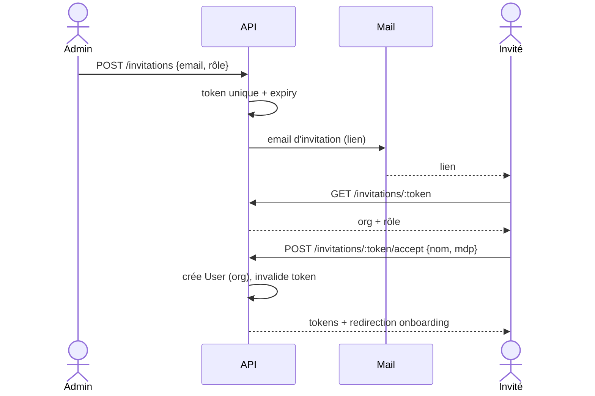

## 11.2 Connexion (avec refresh & 2FA)
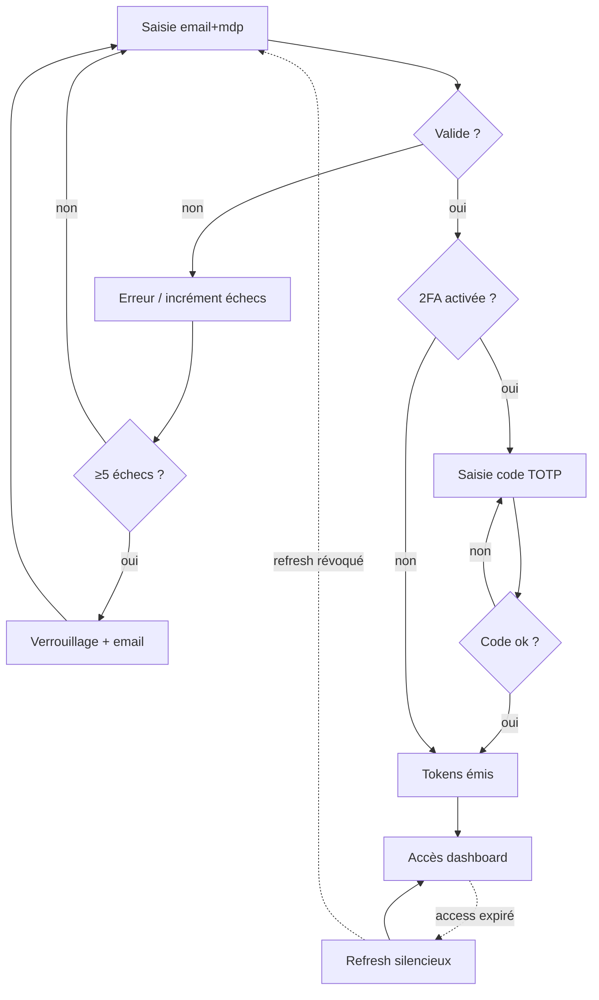

## 11.3 Onboarding (première organisation)
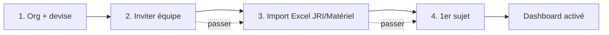

## 11.4 Cycle éditorial (création → validation)
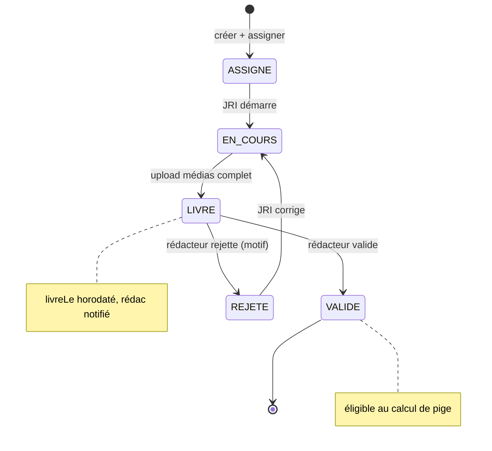

## 11.5 Livraison média résumable (réseau faible)
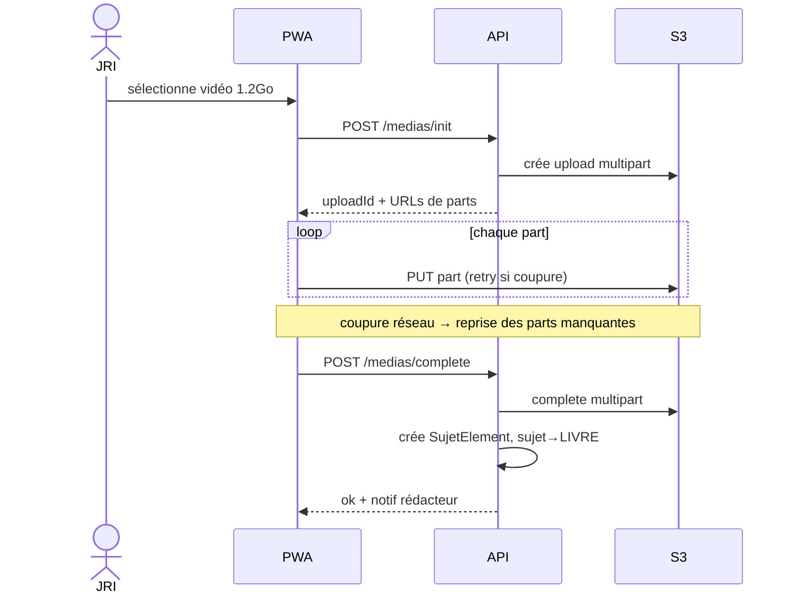

## 11.6 Génération & paiement des piges
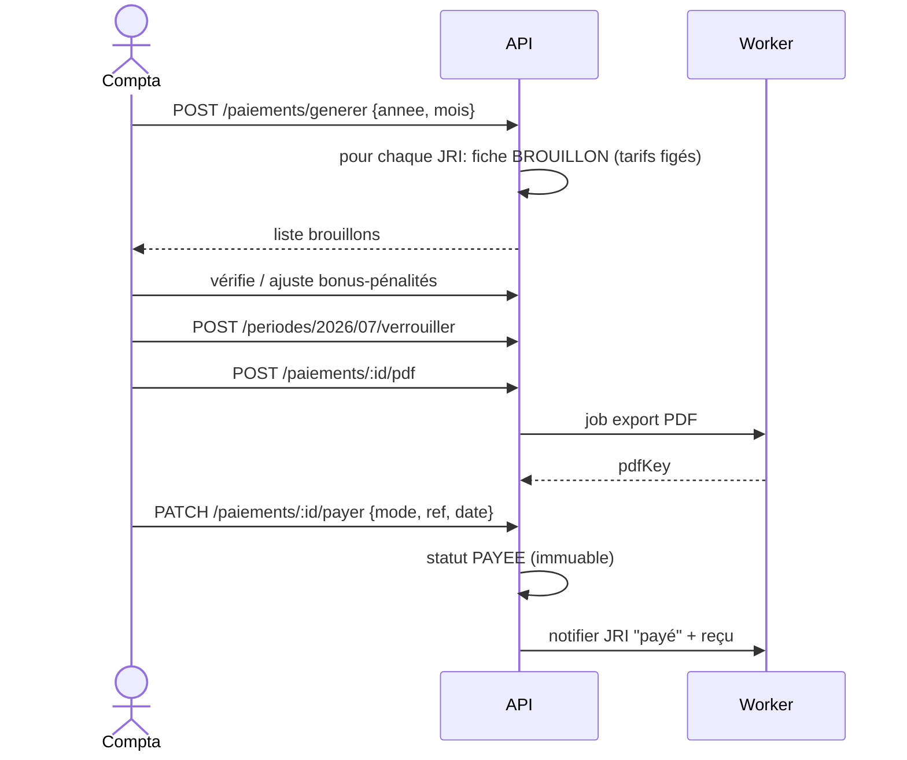

## 11.7 Dotation : remise, suivi, retour avec dégradation
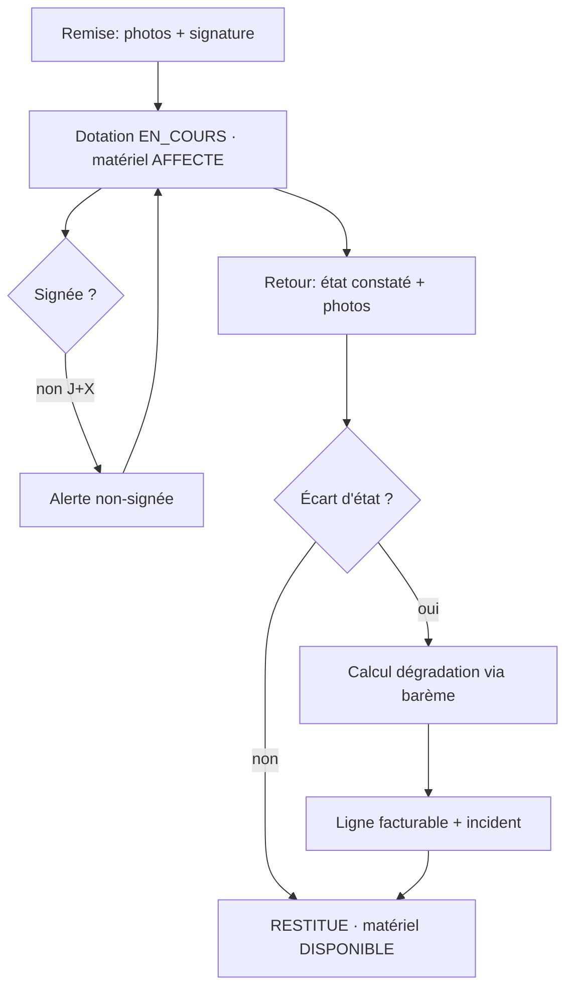

## 11.8 Recherche
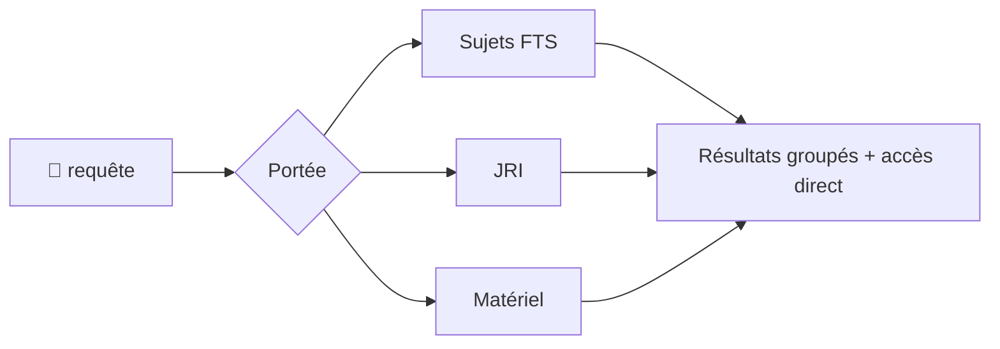

## 11.9 Modification / Suppression (soft delete)
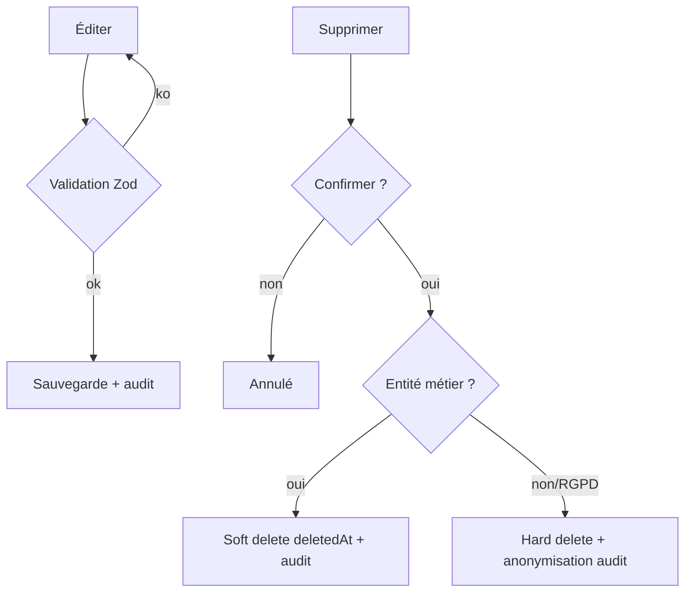

## 11.10 Support
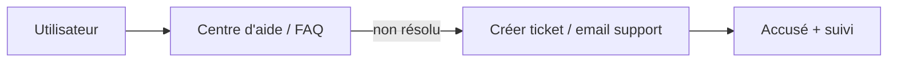

## 11.11 Administration (paramètres org)
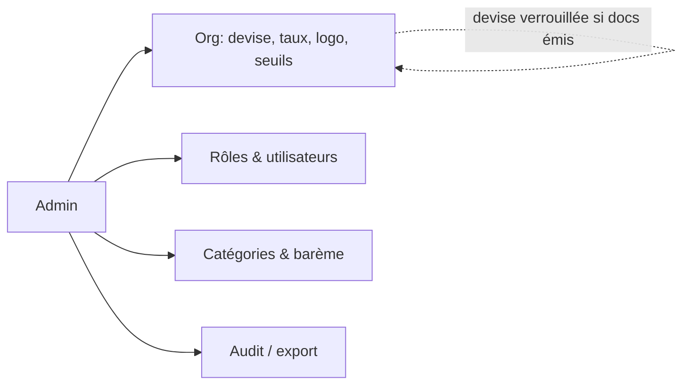

## 11.12 Gestion des erreurs & cas limites
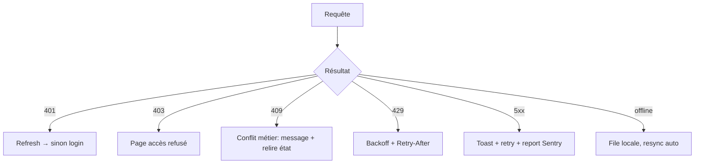
**Cas limites traités** : upload interrompu (reprise), double calcul de pige (idempotence + unicité mois), période verrouillée (409), fiche payée éditée (409), taux de change manquant (bloque l'émission + alerte), dotation supprimée en cours (interdit), JRI supprimé avec fiches (soft delete + conservation documents), concurrence kanban (optimistic + rollback), token invité expiré (410).
