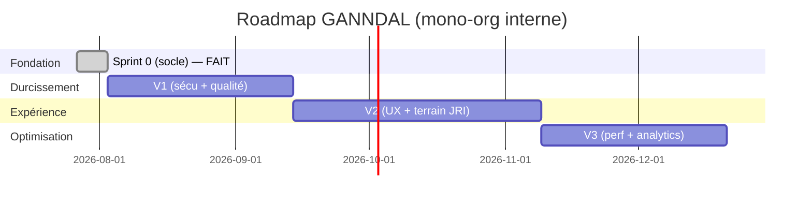

# Phase 13 — Plan de développement (roadmap)

> **Mono-org (D1=A)** : la phase « MVP multi-tenant » est supprimée. Pas de RLS, pas d'`Organisation`, pas d'offre commerciale. Roadmap allégée, centrée sur durcissement + valeur métier interne.

Découpage en paliers. Chaque palier : objectifs · stories · dépendances · risques. Durées indicatives (équipe 2–3 devs). Références de stories : voir `12-BACKLOG.md`.

## Sprint 0 — Socle — ✅ FAIT
- **Objectif** : fondations avant toute feature.
- **Livré** : A1 (migrations Prisma versionnées + baseline prod), H1 (logs pino + requestId), H6 (CI : lint/typecheck/build/migrate/test/audit), B5 (seed prod-safe), I1 (service backup quotidien). Contournement build DNS documenté.
- **Reste** (dépend de comptes externes, à ta main) : B6 (secrets → coffre + **rotation DS-02**), H3 (Sentry DSN), I1+ (PITR/WAL offsite).

## V1 — Durcissement & qualité (6 sem.)
- **Objectifs** : sécurité et fiabilité de niveau production.
- **Stories** :
  - Sécurité : **B1 (refresh silencieux), B2 (rate-limit + lockout login), B3 (2FA TOTP)**, B4 (reset password), A5 (chiffrement IBAN/PII), DS-07 (CSP stricte).
  - Métier : C1 (machine à états sujets), D1–D3 (paie de masse + verrou période + snapshot tarif), DM-01 (immutabilité fiche PAYEE), E5 (QR auto).
  - Infra/qualité : F1 (queue BullMQ), F2 (cron → jobs repeatable + lock), H2 (métriques/traces), H4 (tests API supertest), H5 (E2E Playwright).
- **Dépendances** : Sprint 0. **Risques** : file async (F1) touche les notifications → migrer progressivement (garder fallback synchrone jusqu'à validation).
- **Sortie** : auth durcie, paie fiabilisée, tests couvrant les parcours critiques, observabilité.

## V2 — Expérience & terrain (8 sem.)
- **Objectifs** : réduire la friction, servir le JRI en mobilité, différenciation UX.
- **Stories** : C2 (uploads résumables), C3 (pipeline média : vignettes/preview/AV), G4 (PWA offline JRI), G1 (RSC/SSR — réduire `use client`), G2 (Design System + Storybook), G3 (dark mode), G6 (accessibilité AA), G7 (i18n complète), G8 (recherche FTS), D4 (relances impayés graduées), D5 (reçu + notif payé), D6 (taux gelés/historisés), D7 (Finance⊃Budgets + alerte dépassement), E1/E3 (barème configurable, fiche responsabilité + signature hash), F3/F5 (préférences notif, digest hebdo).
- **Dépendances** : V1 (queue, tests). **Risques** : refonte front (G1/G2) → derrière les E2E de V1 ; transcodage média coûteux → commencer vignettes+preview.
- **Sortie** : app installable, uploads terrain robustes, UX accessible et cohérente.

## V3 — Performance & analytics (6 sem.)
- **Objectifs** : tenir la charge interne, reporting avancé, automatisations.
- **Stories** : optimisation requêtes + index, cache d'agrégats dashboard (Redis), rapports programmés par email, tableaux analytiques (classements/tendances), E2 (scan QR mobile remise/retour), F4 (SMS/push fallback), D8 (attestation annuelle auto), tiering/rétention stockage médias, H7 (k6 charge).
- **Dépendances** : V2. **Risques** : coûts stockage vidéos → politique de rétention explicite.
- **Sortie** : performances validées, reporting riche, automatisations complètes.

## Abandonné (mono-org)
SSO/API publique/webhooks/K8s-HA/audit-immutable-WORM (ex-« Enterprise ») et tout le multi-tenant : **hors périmètre**. Réintroductibles seulement si la stratégie passe un jour au multi-org.

## Dépendances critiques (chemin)
`Sprint 0 (fait) → F1 (queue) → C3 média async, D4 relances, F5 digest`. `H4/H5 (tests) avant G1/G2 (refonte front)`. `B1/B2/B3 (sécu) indépendants → à faire tôt en V1`.
