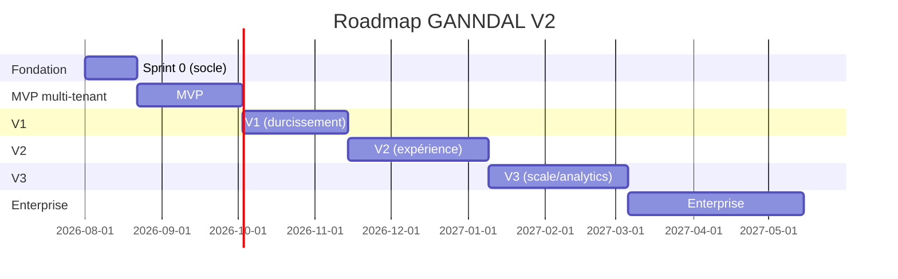

# Phase 13 — Plan de développement (roadmap)

Découpage en paliers. Chaque palier : objectifs · modules · dépendances · risques. Durées indicatives (équipe 2–3 devs).

## Sprint 0 — Socle (3 sem.)
- **Objectifs** : sécuriser les fondations avant toute feature. Rien de visible mais bloquant.
- **Modules/Stories** : A1 (Prisma Migrate), B6 (secrets), H1 (logs), H3 (Sentry), H6 (CI/CD), I1 (backups+PITR), B5 (mots de passe démo hors prod).
- **Dépendances** : aucune (démarre). **Risques** : A1 baseline sur données prod existantes (H) → répéter sur copie d'abord.
- **Sortie** : pipeline CI/CD vert, migrations versionnées, backups fiables, erreurs tracées.

## MVP — Multi-tenant vendable (6 sem.)
- **Objectifs** : un 2e client peut être hébergé en isolation ; boucle métier de base solide.
- **Modules/Stories** : A2, A3, A4, A5 (multi-tenant + RLS + PII), B1, B2, B4 (auth durcie), C1 (états sujets), C2 (uploads résumables), D1–D3 (paie masse + verrou + snapshot), E5 (QR auto), F1–F2 (queue + cron lock).
- **Dépendances** : Sprint 0 (migrations, CI). **Risques** : RLS mal configurée = fuite inter-tenant (H) → tests d'isolation obligatoires (H4 ciblé).
- **Sortie** : onboarding manuel d'un client, cycle éditorial + paie + parc fonctionnels et isolés.

## V1 — Durcissement & confiance (6 sem.)
- **Objectifs** : qualité, sécurité, observabilité de niveau production payante.
- **Modules/Stories** : B3 (2FA), C3 (pipeline média), C4 (validation versionnée), D4–D6 (relances, reçu, taux gelés), E1,E3,E4 (barème, fiche resp., alertes), F3,F5 (préférences, digest), G6 (a11y), G7 (i18n), H2 (métriques/traces), H4–H5 (tests API+E2E), I2–I3 (réplicas, CDN).
- **Dépendances** : MVP. **Risques** : pipeline média (transcodage) coûteux (M) → commencer par vignettes + preview.
- **Sortie** : SLA 99,5 %, tests couvrant les parcours critiques, UX accessible.

## V2 — Expérience & adoption (8 sem.)
- **Objectifs** : réduire la friction, accélérer l'adoption, différenciation UX.
- **Modules/Stories** : G1 (RSC/SSR), G2 (Design System + Storybook), G3 (dark mode), G4 (PWA offline), G5 (onboarding + import Excel), G8 (recherche globale), D7 (Finance⊃Budgets), D8 (attestation auto), C5 (fil d'activité).
- **Dépendances** : V1. **Risques** : refonte front (G1/G2) régressions (M) → derrière tests E2E de V1.
- **Sortie** : self-service onboarding, app installable, dark mode, DS documenté.

## V3 — Scale & analytics (8 sem.)
- **Objectifs** : tenir la charge, rapports avancés, automatisations.
- **Modules/Stories** : read-replica + optimisation requêtes, rapports programmés, tableaux analytiques (classements, tendances), E2 (scan QR mobile), F4 (SMS/push), H7 (k6 charge), tiering stockage médias.
- **Dépendances** : V2. **Risques** : coûts stockage médias (M) → politique de rétention.
- **Sortie** : performance validée en charge, reporting riche.

## Enterprise (10 sem.)
- **Objectifs** : grands comptes, intégrations, HA.
- **Modules/Stories** : J1 (SSO), J2 (API publique), J3 (webhooks), J4 (audit immutable), I4 (K8s + HA multi-nœuds), hébergement dédié, SLA 99,9 %.
- **Dépendances** : V3. **Risques** : complexité opérationnelle K8s (H) → n'ouvrir que sur besoin client réel.
- **Sortie** : offre Enterprise commercialisable.

## Dépendances critiques (chemin)
`A1 → A2/A3 → (tout le métier multi-tenant)`. `F1 (queue) → C3 média async, D4 relances, F5 digest`. `H6 CI/CD → tout déploiement fiable`. Ne pas paralléliser A3 (RLS) avec du dev feature avant tests d'isolation.
